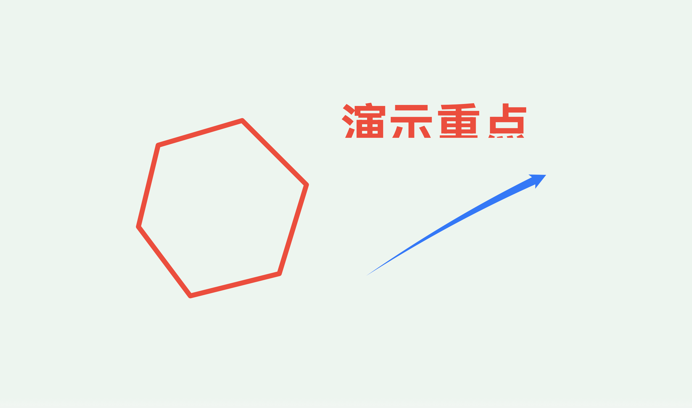
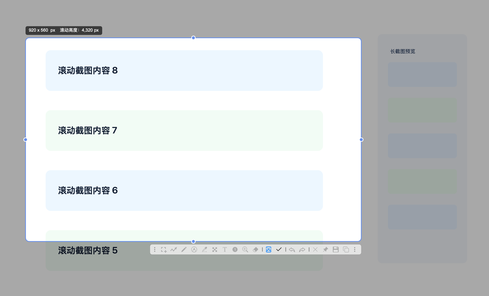
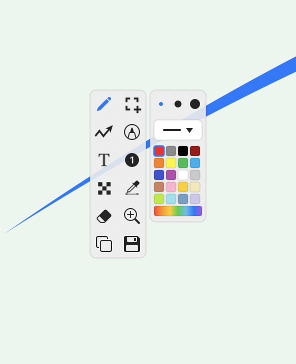
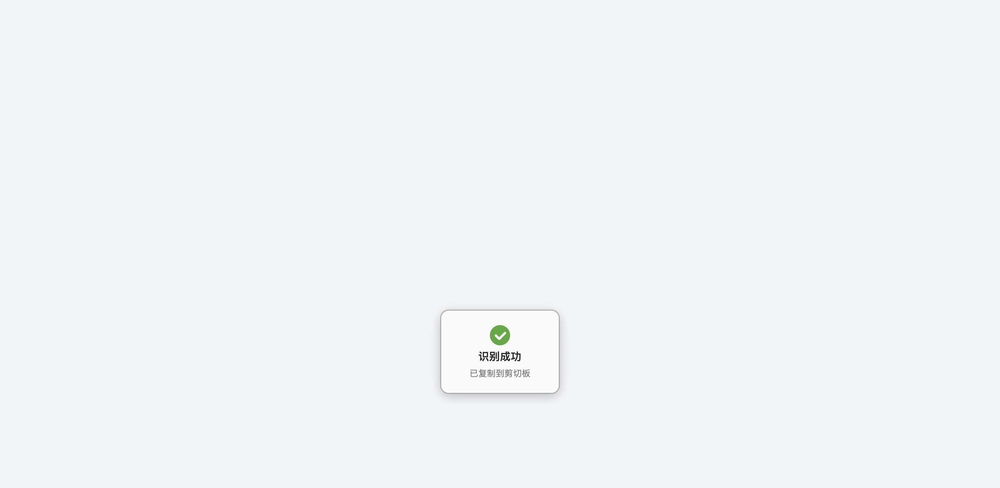
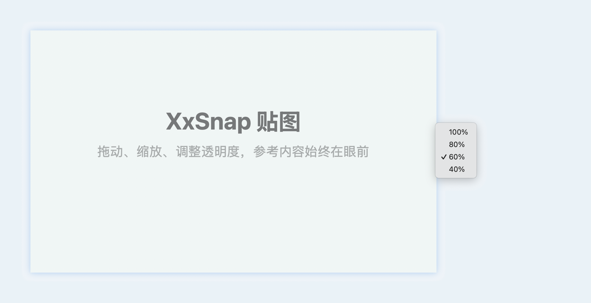
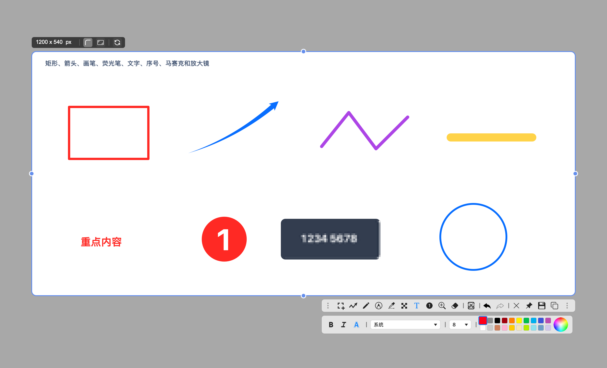

# XxSnap 推广投放文案

> 适用版本：XxSnap 1.1.0（构建号 3）
>
> 当前平台：macOS 14.0 及以上，支持 Apple 芯片与 Intel Mac
>
> 官网：https://xxsnap.xxsofts.com/zh-CN/
>
> 文案更新时间：2026 年 8 月 13 日

## 投放前先看这一段

XxSnap 的优势不需要靠贬低竞品来成立。Snipaste 的截图与贴图基础扎实，PixPin 的滚动截图、录屏和贴图生态也很完整。对外推广时，建议把重点放在 XxSnap 已经做得更直接、更完整的几条工作流上：桌面教笔、低干扰滚动截图、本地文字/二维码识别、超长图安全保存，以及大尺寸贴图查看。

如果你厌倦了截图工具越做越复杂，XxSnap 的核心原则很容易理解：给截图工具做减法。它不追求把所有可能用到的能力都塞进软件，而是主动删掉低频、复杂、容易打断流程的设计，只保留真正高频、上手快、操作路径短的功能。功能不必多，但留下的每一项都应该顺手、可靠，打开就能用。

以下表述可以直接使用：

- “与 Snipaste 相比，XxSnap 已经直接提供滚动截图；当前版本的本地 OCR、滚动截图和教笔也都处于免费期。”
- “与 PixPin 相比，XxSnap 的滚动截图界面更克制：进入后直接滚动，主工具栏只临时增加一个完成按钮。”
- “XxSnap 把教笔做成独立的一级功能，可以直接在当前桌面上讲解，并在保留标注的情况下临时调用文字或二维码识别。”
- “XxSnap 1.1.0 的全部功能目前免费使用。”

以下说法不要使用：

- 不要写“全面超越 PixPin”。PixPin 有录屏、GIF、横向长截图和最高 200 万像素的 Overflow 模式，这些并不是 XxSnap 当前的优势。
- 不要写“Snipaste 没有 OCR”。Snipaste 2.11 已加入专业版文字提取，只是官方更新记录显示其支持腾讯和 OCR.space 等服务，而 XxSnap 当前采用本机识别。
- 不要写“PixPin 的 OCR 会上传图片”。PixPin 官方文档明确说明普通文字识别在本地完成。
- 不要把“当前免费期”写成“永久免费”，也不要在没有正式商用授权说明前写“企业可永久免费商用”。

## 可选标题

### 今日头条、公众号、博客

1. 别急着在 Snipaste 和 PixPin 之间选：这款 Mac 截图工具走了另一条路
2. 如果你受够了截图工具越做越复杂，XxSnap 这套“减法”值得试试
3. 截长图不用反复点按钮：这款 Mac 工具把截图做简单了
4. 用 Mac 截图的人，可能正缺这样一款“少而顺手”的工具
5. 不是功能越多越好：XxSnap 为什么敢给截图工具做减法？
6. 框好直接滚，桌面直接画：XxSnap 把截图后的麻烦省掉了

### 小红书

1. Mac 用户别错过：这款截图工具居然在做减法
2. 如果你常在 Mac 上截图，真的可以试试这套新思路
3. 截长图不用再点来点去，框好直接滚就行
4. 不只会截图，这款 Mac 工具还能直接当教笔
5. 本地 OCR、滚动长截图、桌面教笔，一款就够顺手

### 软件下载站

1. XxSnap 1.1.0 中文版：Mac 截图、滚动长截图、贴图与本地 OCR 工具
2. XxSnap for macOS：支持超长截图、桌面教笔和文字/二维码识别

---

## 今日头条／公众号长文版

# 别急着在 Snipaste 和 PixPin 之间选：这款 Mac 截图工具走了另一条路

> 如果你想要的不是更多按钮，而是滚动截图更直接、桌面讲解更顺手、OCR 不上传，XxSnap 这套“减法”思路可能正合适。

如果你经常在电脑上截图，大概率听说过 Snipaste 和 PixPin。Snipaste 把“截图后贴回屏幕”做成了很多人的习惯，PixPin 又补上滚动截图、OCR 和录屏，功能相当完整。

功能已经这么多，为什么还值得试试 XxSnap？

因为真正影响你效率的，往往不是能不能截到图，而是截完以后还要做多少次切换。你可能要把长网页拼起来，把图片里的文字抄出来；开会讲界面时，还要再找一个桌面画笔；参考图放大后，又被限制在屏幕里。每件事都有工具，但连起来就不顺了。

你可以把 XxSnap 理解成一款“做减法”的截图工具。它不追求功能越多越好，而是删掉低频、复杂、容易打断操作的部分，只留下真正常用、足够便捷的能力。你面对的选择少一点，操作就能直接一点；功能不必面面俱到，但留下的每一项都应该顺手、可靠。

在 XxSnap 1.1.0 里，你可以尽量在同一个流程中完成截图、标注、滚动长截图、贴图、本地识别和桌面讲解。

*不用先截成静态图片，你可以直接在当前桌面上圈重点、画箭头和写字。*

## 滚动截图：点一次，然后正常滚

如果你不喜欢滚动截图时还要操作一排按钮，XxSnap 的处理方式会更合适：它没有再摆出一条复杂的控制栏。

你只要框住网页、聊天记录、表格或文档中的滚动区域，点击滚动截图，接下来直接使用鼠标滚轮或触控板。采集期间，普通标注工具会暂时停用，滚动截图按钮右边只出现一个临时对勾；内容截够了，点一下对勾结束。

*框好区域后直接滚动，右侧预览会同步显示长图进度。*

第一次可靠移动后，XxSnap 会锁定拼接方向。你继续向同一方向滚动，长图就会持续增加；反向滚动只用于回看，不会把旧内容重复拼进去。回到当前末端后，再沿原方向滚动即可继续采集。这套规则看起来不起眼，却能减少长页面中常见的重复、跳段和方向混乱。

超过 29,000 像素后，XxSnap 会切换到超长截图模式。图片仍按原始像素写入 PNG，不会拿缩小后的预览图冒充成品。当前最大高度为 200,000 像素，到达上限才会停止继续拼接。

保存超长图时，截图遮罩会先退出，你的桌面恢复正常，只留下保存进度窗口。即使切换应用，进度窗口也不会消失；如果不想继续，你可以明确点击“取消保存”，而不是误按 Esc 后不知道文件到底写完没有。

Snipaste 官方 FAQ 目前仍把滚动截图列在开发进度入口中，因此这项能力是 XxSnap 相对 Snipaste 最直接的补足。PixPin 的长截图更成熟，甚至有最高 200 万像素的 Overflow 模式；XxSnap 目前更有特点的地方，是把操作收得更简单，并把方向锁定、反向回看、原像素保存和保存进度做成一套清楚的状态。

## 教笔：不是先截图，而是直接在桌面上讲

如果你经常参加远程会议、做产品演示或在线教学，难免要在当前界面上圈一个按钮、画一条箭头，或者临时写两句话。通常的做法是先截图，再打开编辑器，但讲解到这里已经断了。

XxSnap 把教笔做成了独立入口。开启后，你看到的桌面仍保持原来的颜色和内容，可以直接落笔。右键会在指针旁打开一块紧凑工具栏，选完工具、回到画面书写后，工具栏自动让开。

*形状、箭头、荧光笔、文字、马赛克和放大镜，都能直接用在当前桌面上。*

它不只有一支画笔。矩形和椭圆可以改填充，箭头可以调整弧度和两端样式，荧光笔用于压住重点文字，序号可以切换成对勾或红叉，马赛克支持像素化与高斯模糊，还有文字、取色、测距、橡皮擦和局部放大镜。

更实用的是，你可以在使用教笔时临时启动文字/二维码识别。原来的桌面标注仍然保留，只是暂时不接收鼠标；识别结束后可以接着讲，不需要重画。多显示器也按完整桌面处理，工具栏会尽量留在鼠标所在的屏幕内。

Snipaste 专业版提供透明白板命令，能力方向相近，但入口更偏高级功能；PixPin 官方文档主要介绍截图、贴图和录制内容上的标注。XxSnap 把“在真实桌面上边讲边画”放到了一级入口，并把标注、OCR、多屏和保存连在了一起。对于老师、售前、产品经理和远程协作人员，这可能比再多一个截图按钮更有价值。

## 本地文字和二维码识别：框完就能粘贴

XxSnap 的识别模式没有工具栏。你按下快捷键，框住一段文字或二维码，松开鼠标后就会自动识别并复制到剪贴板，接着去微信、Word、备忘录或代码编辑器里粘贴即可。

文字和二维码会自动判断。识别到二维码网址时，XxSnap 只提供“打开链接”按钮，不会替用户自动访问；普通文字、Wi-Fi 信息或其他二维码内容只复制，不乱跳页面。

当前识别过程在本机完成，不上传截图。横排、竖排、中英文及韩文混排都有基本支持。你还能从全屏截图编辑器、长图编辑器或教笔中临时调用它，识别结束后继续原来的任务。

*框选结束自动识别并复制，接下来直接粘贴。*

这里需要把比较说准确：PixPin 的普通 OCR 同样在本地完成，而且贴图文字选择能力很强；Snipaste 2.11 的 OCR 属于专业版，官方更新记录还列出了腾讯和 OCR.space 接口。XxSnap 的优势不是凭空宣称“识别率碾压”，而是当前免费、本地执行、框选即复制，并且和教笔及各类编辑器之间切换得很轻。

## 贴图可以比屏幕大，不必为了“放得下”牺牲细节

如果你经常照着设计稿改页面、核对两份表格，或者把一段说明放在代码旁边，贴图会比反复切换窗口方便得多。

XxSnap 的贴图可以用滚轮或触控板缩放，缩放中心跟随指针。1.1.0 版本把上限提高到当前屏幕可用区域的 4 倍。图片超过屏幕后不强行塞回去，直接拖动查看其他位置即可。

*贴图可以超过屏幕，放大后直接拖动查看细节。*

贴图支持透明度、置顶、隐藏和恢复，你也能再次打开工具栏继续标注。显示透明度只影响桌面上的观看效果，复制或保存时仍输出原来的不透明图片，不会因为你为了对照而调低透明度，最后得到一张发灰的文件。

Snipaste 和 PixPin 都有成熟的贴图能力。XxSnap 在这一项上更强调明确、可预期：屏幕适配只决定初始大小，4 倍可用区域是清楚的查看上限，超过屏幕后继续拖动，不偷偷裁剪源图。

## 标注不是盖一层颜色，而是可以继续修改

需要给截图补充说明时，你可以使用形状、曲线箭头、画笔、荧光笔、文字、序号／对勾／叉号、马赛克、放大镜、取色测距和橡皮擦。

多数标注完成后仍能重新选中、移动、缩放或改样式。曲线箭头可以拖动中间控制点改变弧度，起点和终点分别选择箭头、实心箭头、空心箭头、菱形、端帽或圆点。马赛克和高斯模糊会真正改变导出图片里的底层像素，不是放一块半透明色片遮住敏感信息。

*标注完成后仍可继续选择、移动、缩放和修改样式。*

这些功能单独看并不新鲜，连起来才有意义：截到图以后，你可以直接标清楚、遮干净、贴回桌面，或者复制发送，不需要中途导入另一个图片编辑器。

## XxSnap 比 Snipaste 和 PixPin 更出色的地方，到底是什么？

不是“功能数量最多”。XxSnap 当前没有录屏、GIF，也没有 PixPin 最高 200 万像素的 Overflow 长截图；目前发布版只支持 macOS 14 及以上。

如果你更在意下面几条具体流程，XxSnap 会比单纯堆功能更适合你：

1. 相比 Snipaste，滚动截图已经可以直接使用，不需要等待后续版本。
2. 相比 PixPin，滚动截图界面更轻，进入后直接滚动，完成按钮仍在主工具栏原位置附近。
3. 教笔是独立一级功能，不用先截一张静态图，就能在多屏桌面上讲解、标注、识别、复制或保存。
4. 本地文字／二维码识别不需要确认工具栏，框选完成即复制，还能在教笔和长图编辑过程中临时调用。
5. 超长图按原始像素保存，并提供单独、可取消、切换应用后仍可见的保存进度。
6. 当前 1.1.0 版本所有功能都处于免费期，包括滚动截图、OCR 和教笔。

如果你需要成熟的录屏、GIF、横向长截图或跨 Windows、macOS、Linux 使用，现阶段的 PixPin、Snipaste 仍有各自优势。如果你的主要设备是 Mac，更在意滚动截图少点几步、开会时直接在桌面上画、识别内容不上传，以及超长图片保存时不丢清晰度，XxSnap 值得装上试一遍。

XxSnap 1.1.0 支持 macOS 14.0 及以上，同时兼容 Apple 芯片和 Intel Mac。当前版本全部功能免费。

官网与下载：https://xxsnap.xxsofts.com/zh-CN/

---

## 小红书版

### 标题

Mac 用户别错过：这款截图工具居然在做减法

### 正文

如果你用过 Snipaste 或 PixPin，会发现 XxSnap 走的是另一条路：给截图工具做减法，删掉低频又复杂的选项，只留下真正常用、上手快的功能。

你可以先试试它的滚动截图：框好区域，点一下滚动截图，接下来直接滚鼠标或触控板。没有第二条复杂工具栏，截够了点原工具栏旁边临时出现的对勾。第一次移动后会锁定方向，反向滚动只是回看，不会把旧内容重复拼进去。

长图超过 29,000 像素后会按原始像素直接保存 PNG，最高到 200,000 像素。保存时桌面恢复正常，只留下进度窗口，可以主动取消，不会误按 Esc 就把结果弄没。

另一个值得你试试的功能是“教笔”。它不是先截图再画，而是让你直接在当前桌面上圈重点、画箭头、写字、打马赛克。右键叫出紧凑工具栏，讲完还能把整个桌面连同标注一起复制或保存。中途需要识别文字或二维码也能直接框选，原来的标注不会丢。

OCR 在本机完成，框完自动复制，不上传截图。贴图还能放大到当前屏幕可用区域的 4 倍，超过屏幕后直接拖着看，适合对设计稿、表格和长代码。

你也需要知道，XxSnap 目前没有 PixPin 的录屏、GIF 和 200 万像素 Overflow 长截图，也只支持 macOS 14 以上。但如果你更想要简单的长截图操作、桌面教笔和本地 OCR，它的思路很不一样。

XxSnap 1.1.0 当前全部功能免费，Apple 芯片和 Intel Mac 都能用。

官网：https://xxsnap.xxsofts.com/zh-CN/

#Mac软件 #效率工具

---

## 软件下载站标准资料

### 软件名称

XxSnap

### 当前版本

1.1.0（构建号 3）

### 软件分类

截图工具／图片工具／效率工具

### 运行环境

- macOS 14.0 或更高版本
- Universal 2，同时支持 Apple Silicon 与 Intel x86_64

### 授权说明

当前版本所有功能处于免费期。请勿擅自改写为“永久免费”或“永久免费商用”。

### 一句话简介

XxSnap 是一款面向 macOS 的截图效率工具，集区域与全屏截图、滚动长截图、贴图、本地文字／二维码识别、桌面教笔和图片标注于一体。

### 80 字简介

XxSnap 是一款原生 macOS 截图工具，支持区域截图、全屏截图、滚动长截图、贴图、本地 OCR、二维码识别和桌面教笔。滚动截图可直接使用鼠标或触控板操作，超长图片按原始像素保存。

### 250 字简介

XxSnap 是一款面向 macOS 14 及以上系统的原生截图与标注工具。软件支持区域截图、全屏截图、滚动长截图、桌面贴图、本地文字／二维码识别和教笔模式。滚动截图进入后可直接使用鼠标滚轮或触控板，自动锁定拼接方向，最高支持 200,000 像素高度；超过 29,000 像素后按原始像素直接保存 PNG，并显示独立保存进度。贴图可放大至当前屏幕可用区域的 4 倍，支持拖动查看、透明度、置顶、隐藏恢复和二次标注。教笔能够直接在当前桌面上绘制形状、箭头、文字、马赛克和放大镜，适合远程会议、教学演示与产品讲解。当前版本全部功能处于免费期。

### 完整软件介绍

XxSnap 是一款原生 macOS 截图、贴图和屏幕标注工具，面向需要整理网页资料、制作教程、远程讲解和提取图片文字的用户。

如果你希望截图工具少一些低频选项、多一些直接操作，XxSnap 的“减法”思路会更合适：它主动减少复杂和割裂流程的设计，把常用能力放在更短的操作路径上。

软件支持区域截图与全屏截图，内置形状、曲线箭头、画笔、荧光笔、文字、序号／对勾／叉号、马赛克、局部放大镜、取色测距和橡皮擦。多数标注完成后仍可重新选择、移动、缩放或调整样式。

滚动截图可直接监听鼠标滚轮和触控板操作，并在首次可靠移动后锁定拼接方向。反向滚动用于回看，不会重复增加内容。生成图片超过 29,000 像素后进入超长模式，按原始像素保存为 PNG，当前最高支持 200,000 像素，并提供独立保存进度与取消按钮。

文字与二维码识别在本机完成，框选后自动识别并复制到剪贴板。二维码内容若为网页地址，只显示由用户确认的打开按钮，不会自动访问。识别功能可在全屏编辑器、长图编辑器和教笔期间独立调用。

贴图支持滚轮和触控板缩放、透明度、置顶、隐藏恢复及二次标注。XxSnap 1.1.0 的最大贴图显示尺寸为当前屏幕可用区域的 4 倍，超过屏幕后可直接拖动查看其他部分。

教笔模式可以直接在当前桌面画面上进行标注，右键呼出紧凑工具栏，适合远程会议、软件演示和课堂讲解。完成后可把桌面与标注一起复制或保存。

### 核心功能列表

- 区域截图与全屏截图
- 鼠标滚轮、触控板直接滚动截长图
- 最高 200,000 像素的纵向超长截图
- 原始像素 PNG 保存与独立保存进度
- 多张桌面贴图、置顶、透明度、隐藏与恢复
- 贴图最高放大至当前屏幕可用区域的 4 倍
- 本地文字识别与二维码识别
- 桌面教笔与多显示器讲解
- 曲线箭头、形状、文字、序号、对勾、叉号
- 像素马赛克、高斯模糊、放大镜、取色与测距
- 自定义全局快捷键
- 中英文界面与帮助文档

### 搜索关键词

XxSnap, Mac 截图, macOS 截图工具, 滚动截图, 长截图, 超长截图, 贴图, OCR, 二维码识别, 本地 OCR, 桌面画笔, 教笔, 截图标注, Snipaste 替代, PixPin 替代

---

## 300 字通用短稿

如果你想在 Mac 上更直接地完成截图、贴图和桌面标注，可以试试 XxSnap 1.1.0。它支持区域截图、全屏截图、滚动长截图、本地文字／二维码识别和教笔模式。

进入滚动截图后，你可以直接使用鼠标滚轮或触控板，不需要操作额外的多按钮工具栏。首次可靠滚动会锁定拼接方向，反向滚动只用于回看。超过 29,000 像素后，长图按原始像素保存为 PNG，当前最高支持 200,000 像素，并提供独立保存进度和取消按钮。

需要远程会议或教学演示时，你可以用教笔直接在当前桌面上绘制形状、箭头、文字、马赛克和放大镜。OCR 在本机完成，框选后自动复制；贴图则可放大到当前屏幕可用区域的 4 倍，超过屏幕后继续拖动查看。

如果你觉得 Snipaste 缺少现成的滚动截图，又不需要 PixPin 更庞大的功能组合，XxSnap 更轻的滚动操作和独立桌面教笔值得试试。当前全部功能免费，支持 macOS 14 及以上系统。

官网：https://xxsnap.xxsofts.com/zh-CN/

---

## 15 秒视频口播

如果你受够了截图工具满屏按钮，可以试试 XxSnap。框好区域后，直接用滚轮或触控板截长图；开会讲界面时，你还能在当前桌面上画箭头、写字和打码。OCR 全程在本机完成，贴图最大能放到屏幕可用区域的四倍。XxSnap 1.1.0 当前全部功能免费。

## 30 秒视频口播

如果你用过 Snipaste 和 PixPin，可以再看看 XxSnap 的“减法”思路。框好范围、点一下入口，然后直接滚鼠标或触控板，截够了点旁边的对勾，不用再操作一排控制按钮。需要讲解时，你可以直接在当前桌面上圈重点、画曲线箭头、写字和打码，中途调用 OCR 也不会丢掉原来的标注。超长图按原始像素保存，贴图最大能放到屏幕可用区域的四倍。当前全部功能免费，Apple 芯片和 Intel Mac 都能用。

---

## 配图建议

建议首图不要堆满全部功能，先让读者一眼看懂一个差异点。

1. 首图：教笔覆盖真实桌面，画面上保留箭头、圈选和文字。标题可用“截图工具，也可以直接在桌面上讲”。素材参考：`platforms/mac/Resources/Help/Images/zh-Hans/teaching-pen-overview.png`。
2. 第二张：滚动截图采集界面，突出主工具栏临时对勾和长图预览。素材参考：`platforms/mac/Resources/Help/Images/zh-Hans/capture-scroll-session.png`。
3. 第三张：OCR 框选与成功提示并排，配字“本机识别，松手即复制”。素材参考：`ocr-selection.png`、`ocr-success.png`。
4. 第四张：贴图超过屏幕后的大尺寸查看，配字“最大 4 倍屏幕可用区域，拖动查看”。素材参考：`pin-scale-opacity.png`。
5. 第五张：完整标注工具栏与曲线箭头、马赛克、序号示例。素材参考：`capture-annotation-tools.png`。
6. 结尾图：软件图标、版本号、系统要求和官网二维码，文字控制在四行以内。

## 竞品比较速查表

| 比较项 | XxSnap 1.1.0 | Snipaste 2.x | PixPin 3.x | 推荐宣传口径 |
|---|---|---|---|---|
| 滚动截图 | 已提供；直接滚轮／触控板；方向锁定；最高 20 万像素 | 官方 FAQ 仍列在开发进度入口 | 已提供；功能成熟；Overflow 最高 200 万像素 | XxSnap 明显补足 Snipaste，更偏好简洁操作；不要声称长图能力全面超过 PixPin |
| 桌面教笔 | 独立入口；紧凑工具栏；多屏；可与 OCR 配合 | 专业版有透明白板命令 | 官方文档重点为截图、贴图与录制内容标注 | 强调 XxSnap 的入口直观和完整工作流，不说竞品“完全没有” |
| OCR | 本机完成；文字／二维码自动判断；框完即复制；当前免费 | 2.11 专业版提供文字提取，并支持第三方服务接口 | 普通 OCR 本地完成；贴图文字选择能力强 | XxSnap 的优势是当前免费、直接、与教笔和编辑器连续；不要攻击 PixPin 隐私 |
| 贴图 | 最高 4 倍屏幕可用区域；拖动查看；透明度不影响导出 | 成熟，支持缩放、透明度和丰富快捷键 | 成熟，可贴图片、文字、颜色和文件 | 宣传 XxSnap 的大尺寸查看和明确行为，不写“贴图全面超越” |
| 录屏／GIF | 当前未提供 | 官方 FAQ 列有 GIF 进度入口 | 已提供录屏和 GIF | 不回避，避免用户下载后发现落差 |
| 当前收费状态 | 1.1.0 全功能免费期 | 多项能力属于 PRO；2.x 商业使用需许可 | 大部分免费，部分功能需会员 | 只写“当前免费期”，不承诺永久免费 |
| 平台 | 当前正式版为 macOS 14+ | Windows／macOS／Linux | Windows／macOS | XxSnap 面向 Mac 深度体验，不宣传平台数量优势 |

## 资料来源与事实依据

竞品资料均以官方页面为准，核对日期为 2026 年 8 月 13 日：

- Snipaste 官网：https://www.snipaste.com/
- Snipaste 官方 FAQ：https://www.snipaste.com/faq.html
- Snipaste 官方更新记录：https://github.com/Snipaste/feedback/wiki/Changelog
- Snipaste 官方命令行文档：https://github.com/Snipaste/feedback/wiki/Command-Line-Options
- PixPin 官网：https://pixpin.com/
- PixPin 滚动截图文档：https://pixpin.com/docs/capture/long-capture
- PixPin 快速入门与本地 OCR 说明：https://pixpin.com/docs/start/quick-start
- PixPin 3.2 Overflow 模式说明：https://pixpin.com/docs/change-log/3-2-2-3
- XxSnap 功能事实：项目内置中英文帮助文档及 1.1.0 发布清单
