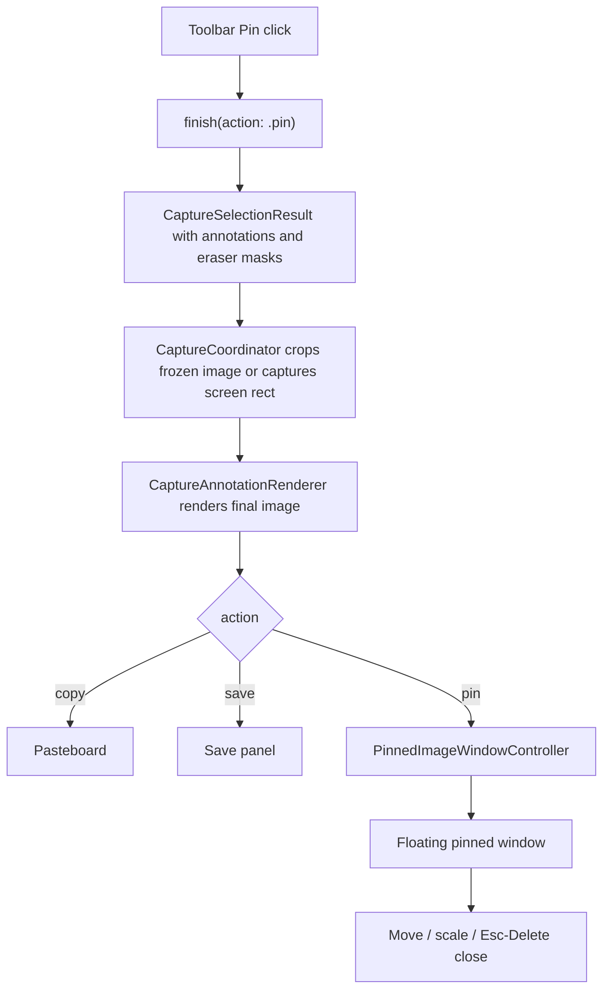

# Pin Tool - Plan

## Goal Capsule

| Field | Value |
|---|---|
| Objective | Turn the mac toolbar Pin entry into a working pinned-image window flow. |
| Authority | User request and `docs/requirements/xxsnap-mac-feature-requirements.md` define the behavior; current mac overlay and legacy Qt pin flow define the implementation pattern. |
| Execution profile | Standard feature work in `platforms/mac/`, with focused AppKit window tests and existing overlay/export tests. |
| Stop conditions | Stop if the pin flow would require changing capture permissions, copy/save semantics, or annotation rendering behavior beyond reusing the existing export renderer. |
| Tail ownership | LFG continues into implementation, review, verification, commit, push, PR, and CI handling after this plan is ready. |

---

## Product Contract

### Summary

The Pin toolbar button and Command+1 shortcut should create a floating, always-on-top image window from the current locked selection instead of showing a placeholder.
The pinned image uses the same rendered pixels as copy/save, including annotations, magnifier effects, mosaics, and eraser masks.
The first version opens the pinned image at the original selection position, adds a faint blue outer glow shadow, supports moving, scaling, and keyboard closing, while deferring opacity, click-through, layer presets, and multi-window management UI.

### Problem Frame

`xxsnap` already treats pinning as a core product capability, but the mac toolbar still routes Pin to the unfinished placeholder.
Users need the same fast screenshot-to-reference workflow as copy/save: finish a selection, keep it visible above other apps, and continue working without saving a file.
The legacy Qt app already proves the product shape by compositing the selected region and annotations before creating a frameless topmost window.

### Requirements

- R1. Clicking Pin or pressing Command+1 on a locked selection creates a pinned image window and closes the capture overlay instead of showing `贴图功能开发中。`.
- R2. The pinned image is rendered from the current selection with the same annotation, magnifier, mosaic, and eraser-mask output as copy/save.
- R3. Pin auto-commits any active non-empty text edit and drops blank text drafts, matching copy/save completion behavior.
- R4. A pinned image window stays above normal app windows, keeps the pinned image at the original selection position, has a faint blue outer glow on all four edges, can be dragged to move, can be scaled without changing aspect ratio, and can be closed with Escape or Delete.
- R5. Pin failure or empty selection does not write to the pasteboard or open a save panel.
- R6. Existing copy, save, cancel, annotation editing, undo/redo, and scroll placeholder behavior remain unchanged.
- R7. Product docs record that Pin is now supported and describe the first-version controls.

### Scope Boundaries

- In scope: mac native pin flow, pinned-window lifecycle, move/scale/close interactions, toolbar routing, documentation updates, and focused tests.
- Deferred to Follow-Up Work: full original-toolbar parity inside pinned images, multi-pin window management UI, and Windows parity.
- Outside this plan: changing annotation model semantics, changing export clipping rules, implementing scroll capture, and changing screen-recording permission behavior.

### Acceptance Examples

- AE1. Given a locked selection with no annotations, when the user clicks Pin or presses Command+1, then the overlay closes and a floating window appears with the selected image at the original selection position.
- AE2. Given a locked selection with rectangle, text, mosaic, magnifier, and eraser-mask effects, when the user clicks Pin, then the pinned image pixels match the existing export renderer output.
- AE3. Given a pinned image window, when the user drags the image body, then the window moves without resizing.
- AE4. Given a pinned image window, when the user uses the scale gesture or wheel shortcut supported by the implementation, then the window scales within min/max bounds while preserving aspect ratio.
- AE5. Given a pinned image window, when the user presses Escape or Delete while it is focused, then the pinned window closes without ending the app.

---

## Planning Contract

### Assumptions

- A1. The first mac implementation may keep pinned images inside AppKit platform code instead of adding shared core abstractions, because windowing is platform-specific.
- A2. Scaling can use a testable AppKit-native gesture path; keyboard close keeps the pinned image chrome-free while richer handles and menus remain follow-up UX polish.
- A3. Pin should reuse the frozen desktop crop when available, exactly like copy/save, so the captured content does not shift while the overlay exits.

### Key Technical Decisions

- KTD1. Reuse `CaptureAnnotationRenderer.render(image:annotations:eraserMasks:)` for Pin output. This keeps pin pixels aligned with copy/save and avoids a second annotation compositor.
- KTD2. Add `pin` to `CaptureCompletionAction` rather than introducing a parallel overlay callback. Pin is another completion command from the same locked selection, and the existing `CaptureSelectionResult` already carries the screen rect, snapshot rect, annotations, and eraser masks.
- KTD3. Own pinned windows from `CaptureCoordinator`. The coordinator already bridges overlay completion to platform actions and can retain window controllers so pinned windows survive after the capture task ends.
- KTD4. Put pinned-window mechanics in a dedicated mac source file. `SelectionOverlayWindow.swift` is already the interaction center; pin window drag, scale, close, and sizing should not make it larger.
- KTD5. Use a pure geometry helper for window sizing and scaling bounds. This makes move/scale behavior testable without depending on live screen or AppKit event timing.

### High-Level Technical Design

### Risks & Dependencies

- The toolbar button currently shares placeholder routing with scroll capture; the change must target Pin only.
- AppKit borderless floating windows can become hard to close if they lose focus, so the first version needs predictable Escape/Delete keyboard close behavior.
- Pixel parity depends on preserving the existing copy/save render path, including eraser masks; tests should compare against renderer output instead of hand-rolled expectations.

### Sources & Research

- `docs/requirements/xxsnap-mac-feature-requirements.md` defines Pin minimum requirements: create a pinned window, preserve annotations, move, scale, close.
- `platforms/mac/Sources/App/CaptureCoordinator.swift` already centralizes copy/save export rendering.
- `platforms/mac/Sources/Overlay/SelectionOverlayWindow.swift` currently routes `.pin` to the placeholder and already packages `CaptureSelectionResult`.
- Legacy `snipory/src/selection/SelectionOverlay.cpp` emits `pinRegionRequested` after hiding the overlay.
- Legacy `snipory/src/platform/DesktopPlatformServices.cpp` creates a frameless always-on-top pinned image window.
- Legacy `snipory/tests/app/TestAppController.cpp` verifies pin capture, annotation compositing, and failure behavior.

---

## Implementation Units

### U1. Add Pin Completion Routing

- **Goal:** Let the overlay finish with a Pin action and keep all existing copy/save packaging behavior.
- **Requirements:** R1, R3, R5, R6.
- **Dependencies:** None.
- **Files:** `platforms/mac/Sources/Overlay/CaptureAnnotationRenderer.swift`, `platforms/mac/Sources/Overlay/SelectionOverlayWindow.swift`, `platforms/mac/Tests/SelectionToolbarStateTests.swift`.
- **Approach:** Add a `pin` completion action, route the `.pin` toolbar button through `finish(action:)`, and leave `.scroll` as the only unfinished placeholder in that switch. Keep text commit and result packaging inside the existing `finish` path.
- **Patterns to follow:** Existing `.copy` and `.save` toolbar completion handling in `SelectionOverlayWindow.swift`.
- **Test scenarios:** Clicking the test toolbar Pin button on a locked selection produces a `CaptureSelectionResult` with `.pin`; active non-empty text is committed before Pin; blank text draft is dropped before Pin; Scroll still shows placeholder behavior and does not finish.
- **Verification:** Focused overlay tests prove Pin is a command completion and copy/save/cancel behavior remains unchanged.

### U2. Create Pinned Window Geometry and Controller

- **Goal:** Add a mac pinned-window implementation that owns image display, original-position placement, faint blue outer glow shadow, move, scale, and close behavior.
- **Requirements:** R4, R5.
- **Dependencies:** None.
- **Files:** `platforms/mac/Sources/App/PinnedImageWindowController.swift`, `platforms/mac/xxsnap.xcodeproj/project.pbxproj`, `platforms/mac/Tests/SelectionToolbarStateTests.swift`.
- **Approach:** Add a dedicated AppKit controller/view pair for a borderless floating window. The transparent content view draws the rendered capture at the original screen rect and reserves an outer margin for a faint blue glow on all four edges; body drag moves the window, supported scale input resizes around the image frame while preserving aspect ratio, and Escape/Delete close the window. Extract size clamping into a pure helper so tests can cover min/max and aspect behavior.
- **Patterns to follow:** Legacy `PinnedImageWindow` in `snipory/src/platform/DesktopPlatformServices.cpp`, plus existing mac project file source registration patterns.
- **Test scenarios:** Initial pinned image frame uses the source screen rect while the window reserves transparent shadow margin; scaling up and down preserves aspect and clamps to min/max; Escape/Delete close actions mark the controller/window closed; drag calculation preserves the click offset; outer four-edge blue glow is enabled and no visible close button is drawn.
- **Verification:** Focused tests cover the geometry helper and controller-visible state without relying on manual screen interaction.

### U3. Wire Pin Export into CaptureCoordinator

- **Goal:** Render the selected image and open a pinned window when the coordinator receives a Pin result.
- **Requirements:** R1, R2, R3, R5.
- **Dependencies:** U1, U2.
- **Files:** `platforms/mac/Sources/App/CaptureCoordinator.swift`, `platforms/mac/Tests/SelectionToolbarStateTests.swift`.
- **Approach:** After the existing crop/capture and annotation render step, switch `.pin` to create and retain a `PinnedImageWindowController` using the result screen rect for original-position placement. Do not write to pasteboard or invoke save panel. Keep `lastCapture` updated with the rendered image so DEBUG tests and future actions see the final pixels.
- **Patterns to follow:** Existing copy/save coordinator flow and legacy Qt controller tests for pin compositing.
- **Test scenarios:** Pin from a frozen image opens one pinned controller with the cropped image and source screen rect; Pin with an annotation uses the renderer output; Pin with eraser masks passes masks into the renderer; Pin does not modify the pasteboard; empty or nil results do not create a pinned window.
- **Verification:** Coordinator tests prove Pin uses the same rendered output and does not regress copy/save.

### U4. Update Toolbar State, Docs, and User-Facing Status

- **Goal:** Make Pin appear as a supported toolbar command in tests and documentation.
- **Requirements:** R1, R6, R7.
- **Dependencies:** U1, U2, U3.
- **Files:** `platforms/mac/Sources/Overlay/SelectionToolbarState.swift`, `platforms/mac/Tests/SelectionToolbarStateTests.swift`, `docs/requirements/xxsnap-mac-feature-requirements.md`, `docs/annotation-tools-user-guide.md`.
- **Approach:** Keep the existing Pin icon, add the Command+1 shortcut to tooltip rendering with an SVG command icon, add any missing DEBUG helper mapping needed for tests, update requirements status from unfinished to implemented, and add a concise user-guide section for move, scale, and close controls.
- **Patterns to follow:** Recent docs updates for magnifier and eraser, and existing toolbar tooltip tests.
- **Test scenarios:** Pin tooltip remains `贴图` with a Command+1 shortcut affordance; Pin icon remains available; unsupported tool placeholder tests cover Scroll only where relevant; docs mention Pin as supported and no longer describe it as unfinished.
- **Verification:** Focused toolbar tests and doc grep checks confirm Pin is no longer documented as a placeholder.

---

## Verification Contract

| Gate | Applies To | Command | Done Signal |
|---|---|---|---|
| Focused mac tests | U1-U4 | `xcodebuild -project platforms/mac/xxsnap.xcodeproj -scheme xxsnap -configuration Debug -derivedDataPath build/xcode-derived -only-testing:xxsnapMacTests/SelectionToolbarStateTests test` | Pin routing, geometry, coordinator, and toolbar tests pass. |
| mac app build | U1-U4 | `xcodebuild -project platforms/mac/xxsnap.xcodeproj -scheme xxsnap -configuration Debug -derivedDataPath build/xcode-derived build` | The app builds with the new source file registered. |
| Manual smoke | U1-U4 | Launch the debug app from `build/xcode-derived`, capture a region, click Pin or press Command+1, move/scale/close the pinned window. | Pinned image appears at the source position above normal windows, has a faint blue outer glow on all four edges, and can be moved, scaled, and closed. |

Full `SelectionToolbarStateTests` currently has known historical magnifier pixel sensitivity, so focused tests plus build are the required gates for this branch unless full-suite failures are unrelated and easy to separate.

---

## Definition of Done

- Pin no longer shows `贴图功能开发中。` for a locked selection.
- Pinned output is generated through the same annotation renderer as copy/save, including eraser masks.
- Pinned windows are retained independently of the capture overlay and remain visible after capture completes.
- Users can trigger Pin with Command+1, and can move, scale, and close each pinned image window with Escape/Delete.
- Copy/save/cancel and Scroll placeholder behavior remain unchanged.
- Focused tests and mac build pass, or any local dependency blocker is recorded with the nearest successful verification.
- Product docs reflect the supported Pin workflow and the still-deferred enhancements.
- The final diff contains no abandoned experimental code.
