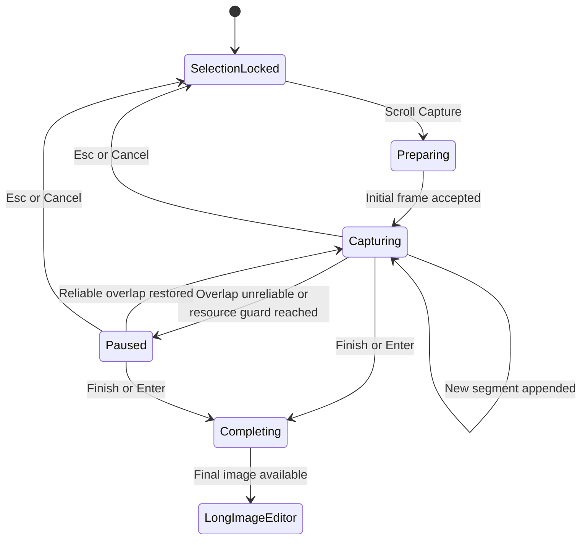

# Scroll Capture - Plan

## Goal Capsule

- **Objective:** Add a reliable manual-scroll capture flow that turns a selected vertical region into an editable long image without duplicating content during pauses or reverse scrolling.
- **Product authority:** Existing xxsnap capture, annotation, export, and pinning behavior remains authoritative; this plan defines the new scroll-capture behavior that joins those flows.
- **Open blockers:** None before implementation planning.

---

## Product Contract

### Summary

xxsnap will let users select a vertical region in any application, scroll it manually, and watch a live tail-following preview while xxsnap captures, deduplicates, and appends new content.
The completed long image will open in a dedicated editor with the existing annotation and output capabilities.

### Problem Frame

The current macOS toolbar exposes a feature-gated scroll-capture command, but the command still shows a development placeholder.
Users need a general-purpose workflow that works across browsers and document applications without relying on application-specific scrolling APIs.
The product must tolerate pauses and small reverse-scroll movements without duplicating, cropping, or reordering content.

### Key Decisions

- **Manual scrolling for the first release.** The user controls the target application with a mouse wheel or trackpad while xxsnap handles sampling and stitching.
- **Downward extension only.** The first frame anchors the top of the long image; upward movement revisits captured content but does not extend or crop the result.
- **Adaptive sampling.** Scroll activity starts short-interval sampling, visible changes keep it active, and stable content returns it to an idle state.
- **Shared stitching rules.** Platform shells own capture and interaction, while reusable frame classification and vertical stitching behavior belongs in the shared core.
- **Dedicated long-image editor.** Completion exits the capture overlay and opens a scrollable, zoomable editor instead of forcing long-image coordinates into the screen selection overlay.
- **Correctness over silent continuity.** Unreliable overlap pauses the session and asks the user to scroll back or slow down rather than silently creating a gap.

### Actors

- A1. **User:** Selects a region, scrolls the target content, completes or cancels capture, and edits or exports the result.
- A2. **macOS shell:** Monitors scroll activity, captures the selected screen region, keeps the toolbar and preview visible, and presents the long-image editor.
- A3. **Shared stitching core:** Classifies frames, rejects repeats, estimates vertical overlap, separates fixed regions, and accumulates accepted content segments.

### Requirements

**Entry and session behavior**

- R1. Scroll capture must start from any locked vertical selection when the feature gate allows it.
- R2. Existing annotations must remain anchored to the first captured screen and reappear in the completed long-image editor.
- R3. During capture, the toolbar must stay visible without changing its layout.
- R4. Annotation commands must be disabled during capture, while Finish Scroll Capture and Cancel remain available.
- R5. The user must finish manually by activating Finish Scroll Capture or pressing `Enter`; pauses and repeated frames must not finish the session.
- R6. The first `Esc` or Cancel action must discard appended scroll segments and restore the original selection, first-screen image, and annotations.
- R7. Cancelling scroll mode must not attempt to restore the target application's scroll position.

**Capture and stitching**

- R8. Mouse-wheel or trackpad activity must trigger adaptive sampling of the selected region.
- R9. Each visible content segment must enter the stitched result at most once.
- R10. Exact repeats, near repeats, and frames that map to previously captured content must be discarded without changing the stitched result.
- R11. Upward scrolling must act as review only; returning downward into uncaptured content must resume appending at the existing tail.
- R12. A new frame must be appended only when it has a reliable vertical overlap with accepted content.
- R13. A frame that cannot be located reliably must pause capture and preserve all accepted content.
- R14. Returning to a reliable overlap must resume capture without requiring a new session.
- R15. Fixed screen-position regions such as navigation bars and input bars must appear only once, using their first-frame representation.
- R16. A high-confidence vertical scrollbar at the left or right selection edge must be cropped from the final result.
- R17. Uncertain scrollbar detection must preserve pixels rather than risk deleting document content.

**Preview and resource protection**

- R18. The live preview must retain a readable scale, follow the newest stitched tail, and allow the user to scroll back through accepted content.
- R19. The preview must prefer the largest available area outside a non-full-screen selection.
- R20. The preview must move inside the selection when outside space is insufficient or the selection is full-screen.
- R21. The capture session must avoid rebuilding the full-resolution image after every accepted frame.
- R22. Approaching a safe memory or image-dimension limit must pause capture and offer to save the current result.

**Editing and output**

- R23. Finishing capture must open the complete image at the top of a dedicated long-image editor using a fit-to-width default view.
- R24. The editor viewport must fit within the current screen and keep its toolbar fixed while the image scrolls.
- R25. Annotation geometry must use original image coordinates so viewport scrolling and zooming do not change export geometry or resolution.
- R26. The editor must expose the existing annotation, undo, redo, copy, save, and pin capabilities.
- R27. Copy and save must export the complete original-resolution image using the same annotation, mosaic, magnifier, and eraser rendering rules as the editor.
- R28. Pin must pin the complete long image and initially scale it into the visible screen area while preserving existing pin move and zoom behavior.
- R29. If the long-image editor cannot open, xxsnap must preserve the completed image and offer a save path.

### Key Flows

- F1. **Capture a long page**
  - **Trigger:** A1 activates Scroll Capture on a locked selection.
  - **Actors:** A1, A2, A3.
  - **Steps:** xxsnap preserves first-screen annotations, captures the initial frame, disables annotation tools, monitors manual scrolling, accepts only reliably located new segments, and refreshes the tail preview.
  - **Outcome:** A1 finishes into a complete long image without duplicate content.
  - **Covered by:** R1-R5, R8-R20.
- F2. **Recover from an unreliable frame**
  - **Trigger:** A3 cannot place a changed frame with sufficient confidence.
  - **Actors:** A1, A2, A3.
  - **Steps:** xxsnap pauses, preserves the result, asks A1 to slow down or return to the last captured section, and resumes after reliable overlap returns.
  - **Outcome:** The long image does not silently contain a gap or incorrect seam.
  - **Covered by:** R12-R14.
- F3. **Edit and export the result**
  - **Trigger:** A1 finishes a capture session.
  - **Actors:** A1, A2.
  - **Steps:** xxsnap finalizes the original-resolution image, opens the long-image editor at the top, restores first-screen annotations, and allows further editing and output.
  - **Outcome:** Copy, save, and pin operate on the complete edited long image.
  - **Covered by:** R23-R29.

### Acceptance Examples

- AE1. **Covers R9-R11.** Given a user scrolls down, pauses, scrolls up through two captured screens, and then scrolls down into new content, the accepted result contains each content segment once and continues from its previous tail.
- AE2. **Covers R15.** Given a webpage with a fixed header, the completed image contains that header once at the top and does not repeat it at each seam.
- AE3. **Covers R16-R17.** Given a clearly detected edge scrollbar, the result excludes it; given an ambiguous narrow edge element, the result preserves that element.
- AE4. **Covers R12-R14.** Given a fast scroll creates insufficient overlap, capture pauses without appending the frame and resumes after the user returns to a reliably captured area.
- AE5. **Covers R18-R20.** Given a selection with sufficient outside space, the preview appears outside; given a full-screen or space-constrained selection, the preview appears inside and follows the latest tail.
- AE6. **Covers R2, R23-R27.** Given annotations exist before scroll capture, the long-image editor opens with those annotations on the first screen and exports them at the correct original-image coordinates.
- AE7. **Covers R6-R7.** Given the user cancels after capturing several segments, xxsnap restores its original selection and annotations while leaving the target application at its user-scrolled position.
- AE8. **Covers R22, R29.** Given a resource guard or editor-opening failure, the user can still save all content accepted before the failure.

### Success Criteria

- Browser long pages and ordinary documents with vertical scrolling must pass the blocking acceptance examples on both mouse-wheel and trackpad input.
- The UI, toolbar, and live preview must remain responsive while accepted content grows.
- Preview, editor, copied image, saved PNG, and pinned image must agree on content order and annotation output.
- Full-screen, edge-constrained, multi-display, light-content, dark-content, Retina, and non-Retina scenarios must receive targeted verification.

### Scope Boundaries

- Bidirectional expansion above the first frame is deferred; the data model should not prevent it later.
- Horizontal and diagonal scroll capture are outside the first release.
- In-capture annotation is outside the first release.
- Automatic scrolling, automatic completion at page bottom, and automatic restoration of the target application's scroll position are outside the first release.
- Chat history, asynchronous infinite lists, virtualized lists, video, and continuously animated content are best-effort compatibility targets rather than release blockers.

### Dependencies / Assumptions

- macOS screen-recording permission and the existing region-capture path remain available throughout the session.
- The selected content primarily moves by vertical translation and retains enough visual overlap between accepted frames.
- Existing annotation rendering and output semantics remain the source of truth for the long-image editor.
- Exact confidence thresholds, resource limits, and adaptive-sampling intervals will be determined during implementation planning and measured against the acceptance corpus.

### Sources / Research

- `platforms/mac/Sources/Capture/ScreenCaptureService.swift` provides the existing ScreenCaptureKit region-capture path.
- `platforms/mac/Sources/Overlay/SelectionOverlayWindow.swift` contains the feature-gated toolbar entry and current placeholder behavior.
- `platforms/mac/Sources/App/CaptureCoordinator.swift` and `platforms/mac/Sources/Overlay/CaptureAnnotationRenderer.swift` define current output and annotation semantics.
- `../ScrollSnap/ScrollSnap/Managers/OverlayManager.swift` demonstrates manual scrolling, timer sampling, overlay event pass-through, and explicit completion on macOS.
- `../ScrollSnap/ScrollSnap/Managers/StitchingManager.swift` demonstrates Vision-based adjacent-frame translation but does not provide the required repeat, quality, or reverse-scroll guarantees.
- `../easy-capture/Windows/scrollerwindow.cpp` demonstrates automatic and manual modes, repeated-frame end detection, and failure-aware session states.
- `../easy-capture/Windows/ScrollHandler/` demonstrates ordered parallel merging; it is GPL-3.0 and is research-only, not a source for copied implementation.
- `../fastsnip/` contains no scrolling capture or stitching implementation.

### Outstanding Questions

**Deferred to Planning**

- What confidence model and fixture thresholds distinguish repeat, review, append, and pause states?
- What adaptive-sampling intervals keep trackpad scrolling reliable without wasting capture work during pauses?
- What resource budget should trigger the safety pause on supported macOS hardware?
- Which existing editor and pin-window components can be reused without coupling long-image coordinates to screen coordinates?
