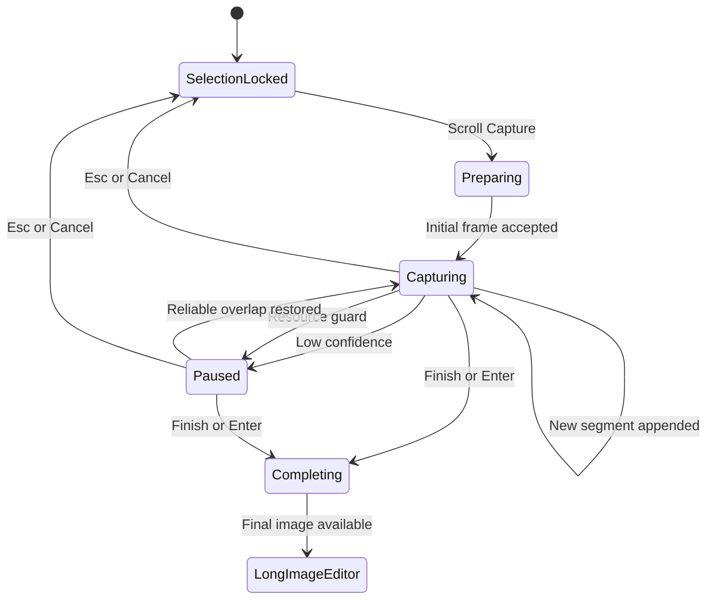
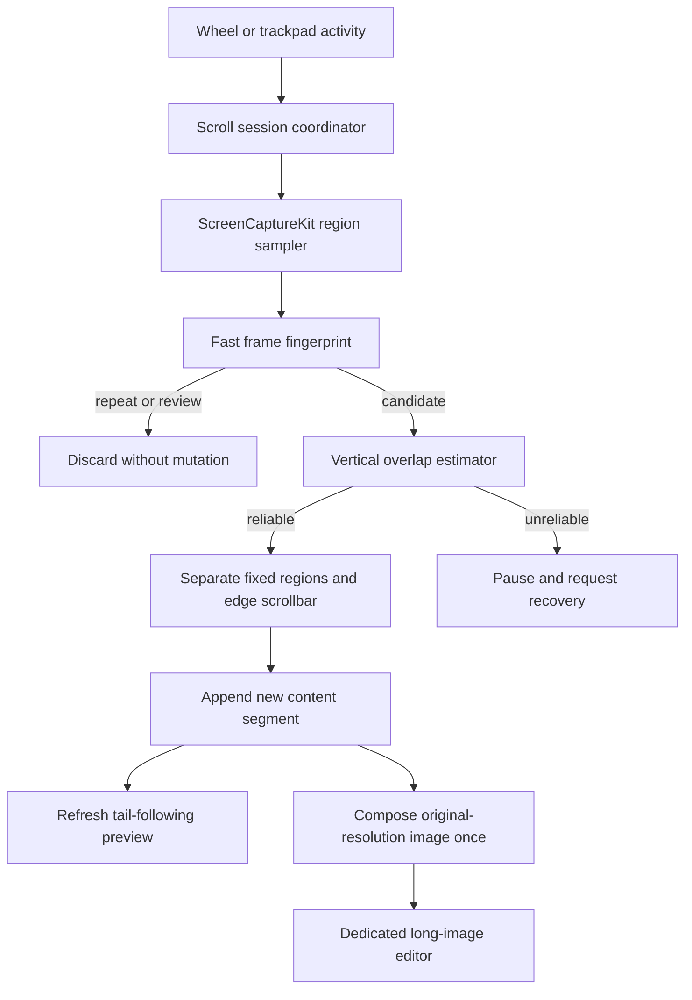

# Scroll Capture Design

## Overview

xxsnap will capture long vertical content by letting the user scroll a selected region manually while the application samples, deduplicates, aligns, and appends new pixels.
The first release prioritizes browser long pages and ordinary documents, preserves already accepted content during reverse scrolling, and opens the result in a dedicated long-image editor.

## Current State

- The macOS toolbar exposes Scroll Capture behind the existing feature gate.
- Activating the command currently shows a development placeholder.
- `ScreenCaptureService` already captures an arbitrary screen region with ScreenCaptureKit while excluding xxsnap.
- The existing completion pipeline renders annotations and supports copy, save, and pin.
- The current selection overlay assumes the image and annotation viewport match the on-screen selection, so it is not the right final editor for a long image.

## Goals

- Support any application with vertically scrolling visible content.
- Let users scroll with a mouse wheel or trackpad.
- Add each content segment at most once despite pauses and reverse scrolling.
- Keep a live, readable preview and the existing toolbar visible during capture.
- Preserve annotations created before scroll capture.
- Continue into full annotation, copy, save, and pin workflows.
- Keep reusable stitching rules in the shared core for later Windows support.

## Non-goals

- Automatic scrolling or automatic completion at page bottom.
- Upward extension above the initial frame.
- Horizontal or diagonal scrolling.
- Annotation while capture is active.
- Automatic restoration of the target application's scroll position.
- Guaranteed first-release support for virtualized lists, infinite feeds, video, or continuous animation.

## Reference Project Findings

### ScrollSnap

ScrollSnap is the closest macOS reference.
It captures a selected region every 250 ms, makes its overlay mouse-transparent during capture, uses Vision translation registration between adjacent frames, and finishes when the user activates the command again.

Useful patterns:

- Explicit capture-session state.
- ScreenCaptureKit region sampling that excludes the application overlay.
- Mouse pass-through so the target application remains scrollable.
- Serial stitching work to preserve frame order.

Gaps relative to xxsnap:

- No automatic duplicate-history handling beyond zero movement.
- No confidence state or user-visible recovery flow.
- Upward movement crops the accumulated image, which conflicts with xxsnap's immutable accepted-content rule.
- No dedicated integration with xxsnap annotations and output.

ScrollSnap is MIT-licensed and may inform implementation patterns with required attribution when copied substantially.

### easy-capture

easy-capture has a broader Windows state machine with automatic and manual capture modes, configurable capture intervals, repeated-frame end detection, multithreaded ordered merging, and an edit-window handoff.

Useful ideas:

- Separate idle, region-selection, automatic, manual, and completion states.
- Preserve ordering when matching work finishes concurrently.
- Provide fallback behavior when feature matching fails.
- Move completed output into the normal editing experience.

The code is GPL-3.0.
xxsnap may use its product and algorithm ideas as research, but must not copy implementation code unless the project intentionally adopts compatible licensing.

### FastSnip

FastSnip does not contain continuous capture, long-image stitching, or scroll-capture behavior.
Its quick capture-to-output flow is not a technical reference for this feature.

## User Flow

1. The user locks a selection and may add first-screen annotations.
2. The user activates Scroll Capture.
3. xxsnap commits any active text edit, preserves existing annotations, captures the initial raw frame, and disables annotation commands.
4. The toolbar remains visible; Scroll Capture becomes Finish Scroll Capture, and Cancel remains enabled.
5. Wheel or trackpad activity arms adaptive sampling.
6. Exact or near repeats and frames mapped to captured content are discarded.
7. Reliably aligned new content is appended once and the tail preview refreshes.
8. An unreliable frame pauses capture and prompts the user to scroll slowly or return to the previous captured area.
9. The user finishes by activating Finish Scroll Capture or pressing `Enter`.
10. xxsnap finalizes the original-resolution image and opens the dedicated long-image editor at the top.
11. The user annotates, copies, saves, or pins the complete image.

`Esc` or Cancel during capture discards appended segments and restores the xxsnap selection, initial screenshot, and existing annotations.
It does not restore the target application's scroll position.

## Session State Model

## Architecture

### macOS Shell

The macOS layer owns:

- Scroll-session lifecycle and UI state.
- Wheel and trackpad activity monitoring.
- Region capture with ScreenCaptureKit.
- Overlay event pass-through while leaving the toolbar controllable.
- Preview placement and rendering.
- Dedicated long-image editor and platform output windows.

### Shared Core

The shared core owns:

- Low-resolution frame fingerprints.
- Repeat and previously-seen classification.
- Vertical overlap estimation and confidence.
- Fixed screen-position region classification.
- Ordered accepted segments and deferred final composition.
- Resource-accounting inputs that let the platform enforce a safe limit.

The first release narrows matching to vertical translation and should not require OpenCV.
A lightweight coarse-to-fine pixel matcher is preferable because the shared core already exists, the motion model is constrained, and a large dependency would expand packaging and maintenance costs.

### Data Flow

## Frame Acceptance and Stitching

### Duplicate and Review Detection

Each captured frame first receives a low-resolution fingerprint.
Frames sufficiently similar to the current viewport or indexed accepted regions are discarded before full alignment.
This makes pauses and small upward review movements inexpensive and prevents previously accepted content from entering the result twice.

The first release never removes accepted segments because of later scrolling.
When the user returns downward, the session resumes only when the current frame maps to the accepted tail and exposes new content below it.

### Vertical Overlap

Candidate frames are matched under a vertical-translation-only model.
The matcher estimates displacement and confidence from regions that move consistently between frames.
A frame is accepted only when overlap is sufficient, the displacement is plausible, and one placement is materially stronger than alternatives.

Only the non-overlapping bottom strip becomes a new segment.
The session stores segments rather than redrawing an ever-growing bitmap after every frame.

### Fixed Regions

Screen-position-stable bands such as fixed headers, toolbars, and chat inputs are excluded from motion estimation after the initial frame.
Their first-frame representation remains in the output, and later copies are not appended.

The design must prefer false negatives over false positives.
Failing to identify a fixed band may pause or leave an artifact; incorrectly identifying scrolling document content as fixed would delete user content.

### Scrollbar Cropping

The system may crop a narrow left or right edge only when its geometry and frame-to-frame changes provide high-confidence scrollbar evidence.
An ambiguous edge is preserved.
Scrollbar pixels must not participate in overlap estimation even when the final crop decision remains uncertain.

## Adaptive Sampling

Scroll activity starts a short sampling burst.
Sampling continues while the selected pixels change and becomes idle after the view stabilizes.
Inertial scrolling remains covered even after direct input events stop.

The sampler must never start another capture while the previous capture request is still in flight.
Repeated stable frames should be rejected with the fast fingerprint path rather than full alignment.
Exact intervals and stability windows are planning-time constants validated against mouse and trackpad fixtures.

## Live Preview

The preview shows a readable tail of the accepted long image and follows each successful append.
The user may scroll the preview backward without changing capture order or the target application.

Placement rules:

1. Use the largest available outside area for a non-full-screen selection.
2. Move inside the selection when outside space is insufficient.
3. Use an inside floating preview for a full-screen selection.

The preview uses downsampled segments and does not render the final full-resolution bitmap after every frame.
The capture toolbar stays visible above the preview and target content.

## Capture Toolbar

- The toolbar keeps its current position and dimensions during capture.
- Annotation commands remain visible but disabled.
- Scroll Capture becomes Finish Scroll Capture and remains highlighted.
- Cancel stays enabled.
- `Enter` finishes the current result.
- `Esc` first exits scroll mode and returns to the locked selection state.

## Long-image Editor

The dedicated editor opens after final composition.
It starts at the image top, defaults to fit width, and keeps its window inside the current screen's visible frame.
Its annotation toolbar does not scroll with the image.

Image and annotation geometry use original-image coordinates.
Viewport scrolling and zooming are transforms only, so preview and export remain consistent.
Existing first-screen annotations keep their original position, and new annotations use the same renderer and undo/redo semantics as ordinary captures.

Copy and save export the complete original-resolution image.
Pin creates a pin for the complete long image, initially scaled to the visible screen while retaining current pin movement and zoom behavior.

## Error and Resource Handling

- Initial capture failure returns to the locked selection with an actionable error.
- Low overlap, ambiguous placement, or excessive scroll displacement pauses without mutating accepted content.
- Reliable overlap after a pause resumes the same session.
- Approaching a safe memory or image-dimension limit pauses and offers completion with the current result.
- Final composition failure retains accepted segments and offers recovery or save.
- Editor creation failure retains the completed image and offers save.

## Testing Strategy

### Shared Core

- Exact duplicate and near-duplicate rejection.
- Downward append with several overlap sizes and pixel scales.
- Pause, upward review, and downward resume without duplicate content.
- Fixed header and footer retention exactly once.
- High-confidence scrollbar cropping and ambiguous-edge preservation.
- Low-confidence, fast-scroll, blank-region, and repeated-pattern failures.
- Segment ordering and deferred final composition.
- Resource-accounting behavior.

Synthetic fixtures should be complemented by checked-in image sequences for browser pages and documents in light and dark themes.

### macOS Orchestration

- Session-state transitions and command availability.
- Existing annotation retention on the first screen.
- Adaptive sampling without concurrent capture requests.
- Preview placement outside, inside, full-screen, and multi-display selections.
- Cancel restoration and manual completion.
- Failure preservation and save fallback.
- Dedicated editor coordinate transforms and output parity.

### Manual Smoke Checks

- Safari and Chrome long pages with and without fixed headers.
- Preview or a text editor with a long document.
- Mouse wheel and trackpad with inertial scrolling.
- Pauses, short upward reviews, and return to new downward content.
- Full-screen, edge-constrained, Retina, non-Retina, and multi-display selections.
- Long-image annotation, copy, save, and full-image pinning.

## Acceptance Criteria

- Every accepted content segment appears once and in vertical order.
- Pauses and upward review never crop, reorder, or duplicate the result.
- Fixed screen-position regions appear once.
- High-confidence scrollbars are removed without cropping document content.
- Unreliable matching pauses instead of silently producing a bad seam.
- The toolbar and tail preview remain responsive throughout capture.
- Existing annotations survive into the first screen of the long-image editor.
- Editor, clipboard, saved PNG, and pin agree on full-image content and annotations.
- Resource limits and post-capture failures preserve a user-saveable result.
