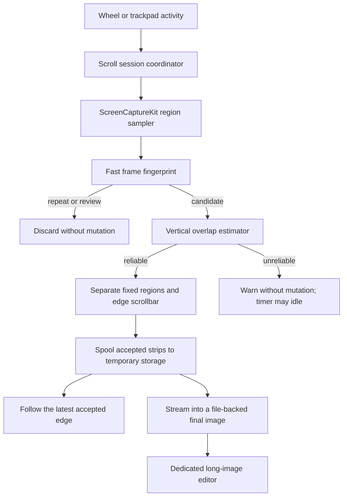

# Scroll Capture Design

## Overview

xxsnap will capture long vertical content by letting the user scroll a selected region manually while the application samples, deduplicates, aligns, and extends the result in one locked vertical direction.
The first release prioritizes browser long pages and ordinary documents, preserves already accepted content during reverse scrolling, and opens the result in a dedicated long-image editor.

## Revision — 2026-07-12 Direction Lock and Sampling Recovery

This section records the 2026-07-12 incremental decision and supersedes the original down-only/upward-review details below where they conflict; the document's original 2026-07-11 date remains unchanged.

- The first unique reliable movement locks the session to `Up` or `Down`. `Down` appends below the initial seed; `Up` prepends above it. Final output remains in natural document order.
- A session extends only one side of the seed. Reverse movement after the lock is review/dedup only and never changes direction; capturing the other side requires a new session. Horizontal capture remains deferred.
- Low confidence produces a non-blocking warning and never automatically pauses the session. Sustained low-confidence or stable frames may let the sampling timer go idle; the next wheel or trackpad activity immediately rearms it.
- Awaiting fixed-band evidence is normal continued sampling, clears any prior low-confidence warning, and does not show a new warning.
- An initial seed/start failure cancels the scroll session, closes its preview, and restores the original locked selection; no Finish path exists before the seed is accepted. During collection, only a live capture failure after seed acceptance and resource guards create a blocking pause. A final-composition failure returns to a paused Retry Finish/Cancel path.

## Current State

- The macOS toolbar exposes Scroll Capture behind the existing feature gate.
- Activating the command starts the implemented direction-locked scroll-capture session.
- `ScreenCaptureService` already captures an arbitrary screen region with ScreenCaptureKit while excluding xxsnap.
- The existing completion pipeline renders annotations and supports copy, save, and pin.
- The current selection overlay assumes the image and annotation viewport match the on-screen selection, so it is not the right final editor for a long image.

## Goals

- Support any application with vertically scrolling visible content.
- Let users scroll with a mouse wheel or trackpad.
- Add each content segment at most once despite pauses and reverse scrolling.
- Keep a live, readable preview and the existing toolbar visible during capture.
- Preserve annotations created before scroll capture.
- Continue into full annotation, copy, save, and pin workflows.
- Keep reusable stitching rules in the shared core for later Windows support.

## Non-goals

- Automatic scrolling or automatic completion at page bottom.
- Horizontal or diagonal scrolling.
- Extending both sides of the initial frame in one session.
- Annotation while capture is active.
- Automatic restoration of the target application's scroll position.
- Guaranteed first-release support for virtualized lists, infinite feeds, video, or continuous animation.

## Reference Project Findings

### ScrollSnap

ScrollSnap is the closest macOS reference.
It captures a selected region every 250 ms, makes its overlay mouse-transparent during capture, uses Vision translation registration between adjacent frames, and finishes when the user activates the command again.

Useful patterns:

- Explicit capture-session state.
- ScreenCaptureKit region sampling that excludes the application overlay.
- Mouse pass-through so the target application remains scrollable.
- Serial stitching work to preserve frame order.

Gaps relative to xxsnap:

- No automatic duplicate-history handling beyond zero movement.
- No confidence state or user-visible recovery flow.
- Upward movement crops the accumulated image, which conflicts with xxsnap's immutable accepted-content rule.
- No dedicated integration with xxsnap annotations and output.

ScrollSnap is MIT-licensed and may inform implementation patterns with required attribution when copied substantially.

### easy-capture

easy-capture has a broader Windows state machine with automatic and manual capture modes, configurable capture intervals, repeated-frame end detection, multithreaded ordered merging, and an edit-window handoff.

Useful ideas:

- Separate idle, region-selection, automatic, manual, and completion states.
- Preserve ordering when matching work finishes concurrently.
- Provide fallback behavior when feature matching fails.
- Move completed output into the normal editing experience.

The code is GPL-3.0.
xxsnap may use its product and algorithm ideas as research, but must not copy implementation code unless the project intentionally adopts compatible licensing.

### FastSnip

FastSnip does not contain continuous capture, long-image stitching, or scroll-capture behavior.
Its quick capture-to-output flow is not a technical reference for this feature.

## User Flow

1. The user locks a selection and may add first-screen annotations.
2. The user activates Scroll Capture.
3. xxsnap commits any active text edit, preserves existing annotations, captures the initial raw frame, and disables annotation commands.
4. The toolbar remains visible; Scroll Capture becomes Finish Scroll Capture, and Cancel remains enabled.
5. Wheel or trackpad activity arms adaptive sampling.
6. Exact or near repeats and frames mapped to captured content are discarded.
7. The first unique reliable movement locks `Up` or `Down`; reliably aligned new content is appended below or prepended above the seed once, in natural document order, and the preview refreshes.
8. An unreliable frame shows a non-blocking warning without mutating accepted content. Sustained low-confidence or stable frames may idle sampling until the next wheel or trackpad activity rearms it.
9. The user finishes by activating Finish Scroll Capture or pressing `Enter`.
10. xxsnap finalizes the original-resolution image and opens the dedicated long-image editor at the top.
11. The user annotates, copies, saves, or pins the complete image.

`Esc` or Cancel during capture discards accepted segments beyond the initial seed and restores the xxsnap selection, initial screenshot, and existing annotations.
It does not restore the target application's scroll position.

## Session State Model

```mermaid
stateDiagram-v2
  [*] --> SelectionLocked
  SelectionLocked --> Preparing: Scroll Capture
  Preparing --> Capturing: Initial frame accepted
  Preparing --> SelectionLocked: Seed or start failure; cancel session
  Capturing --> Capturing: Repeat or review frame
  Capturing --> Capturing: Direction locked or segment accepted
  Capturing --> Capturing: Low-confidence warning or sampling idle/rearm
  Capturing --> Paused: Live capture failure or resource guard
  Capturing --> Completing: Finish or Enter
  Paused --> Completing: Finish or Enter
  Completing --> LongImageEditor: Final image available
  Completing --> Paused: Final composition failure; retry Finish or Cancel
  Capturing --> SelectionLocked: Esc or Cancel
  Paused --> SelectionLocked: Esc or Cancel
```

## Architecture

### macOS Shell

The macOS layer owns:

- Scroll-session lifecycle and UI state.
- Wheel and trackpad activity monitoring.
- Region capture with ScreenCaptureKit.
- Overlay event pass-through while leaving the toolbar controllable.
- Preview placement and rendering.
- Dedicated long-image editor and platform output windows.

### Shared Core

The shared core owns:

- Low-resolution frame fingerprints.
- Repeat and previously-seen classification.
- Vertical overlap estimation and confidence.
- Fixed screen-position region classification.
- Ordered accepted segments and deferred final composition.
- Resource-accounting inputs that let the platform enforce a safe limit.

The first release narrows matching to vertical translation and should not require OpenCV.
A lightweight coarse-to-fine pixel matcher is preferable because the shared core already exists, the motion model is constrained, and a large dependency would expand packaging and maintenance costs.

### Data Flow

## Frame Acceptance and Stitching

### Duplicate and Review Detection

Each captured frame first receives a low-resolution fingerprint.
Frames sufficiently similar to the current viewport or indexed accepted regions are discarded before full alignment.
This makes stationary frames and reverse review movements inexpensive and prevents previously accepted content from entering the result twice.

The first release never removes accepted segments because of later scrolling.
The first unique reliable displacement locks the session direction. A `Down` session accepts only new content beyond the accepted tail below the seed; an `Up` session accepts only new content beyond the accepted head above the seed. Reverse movement maps only to review/dedup and never changes the lock or extends the seed's other side. Capturing that other side requires a new session.

### Vertical Overlap

Candidate frames are matched under a vertical-translation-only model.
The matcher estimates displacement and confidence from regions that move consistently between frames.
A frame is accepted only when overlap is sufficient, the displacement is plausible, and one placement is materially stronger than alternatives.

For `Down`, only the non-overlapping bottom strip becomes a new segment appended below the seed. For `Up`, only the non-overlapping top strip becomes a new segment prepended above the seed; composition preserves natural top-to-bottom order.
The session writes committed strips to an automatically removed temporary file rather than retaining them as heap images or redrawing an ever-growing bitmap after every frame. Memory retains only the initial opposite frontier, current matching viewport, bounded fixed-band evidence, a bounded recent fingerprint history, and preview buffers. Segment metadata carries stable document offsets so preview lookup remains logarithmic as frame count grows.

The macOS bridge streams final rows directly into file-backed mapped storage used by Core Graphics. It does not first allocate a complete core bitmap and then copy that bitmap into a second AppKit buffer. PNG save uses ImageIO directly from the `CGImage`, avoiding TIFF and full PNG `Data` intermediates.

This makes capture memory a bounded working set, but it does not make capture mathematically unlimited. Temporary-disk use, matching time, output dimensions, PNG encoding time, and downstream framework limits still grow with the accepted pixel count. Exhausted disk space or an unsupported final image dimension must preserve the accepted result and report a completion error; the product must not promise that every machine can finish an arbitrary 10,000-frame full-resolution image.

### Fixed Regions

Screen-position-stable bands such as fixed headers, toolbars, and chat inputs are excluded from motion estimation after the initial frame.
Their first-frame representation remains in the output, and later copies are not appended.

The design must prefer false negatives over false positives.
While fixed-band evidence is still accumulating, sampling continues normally, clears any prior low-confidence warning, and does not show a new warning. Failing to identify a fixed band may leave an artifact; incorrectly identifying scrolling document content as fixed would delete user content.

### Scrollbar Cropping

The system may crop a narrow left or right edge only when its geometry and frame-to-frame changes provide high-confidence scrollbar evidence.
An ambiguous edge is preserved.
Scrollbar pixels must not participate in overlap estimation even when the final crop decision remains uncertain.

## Adaptive Sampling

Scroll activity starts a short sampling burst.
Sampling continues while the selected pixels change and becomes idle after the view stabilizes.
Inertial scrolling remains covered even after direct input events stop.
Sustained low-confidence frames may also let the sampling timer become idle, but low confidence itself is not a paused session state. The next wheel or trackpad event immediately rearms sampling.

The sampler must never start another capture while the previous capture request is still in flight.
Repeated stable frames should be rejected with the fast fingerprint path rather than full alignment.
Exact intervals and stability windows are planning-time constants validated against mouse and trackpad fixtures.

## Live Preview

The preview shows a readable portion of the accepted long image and follows the latest accepted edge: the bottom for `Down`, the top for `Up`.
The user may scroll the preview backward without changing capture order or the target application.

Placement rules:

1. Use the largest available outside area for a non-full-screen selection.
2. Move inside the selection when outside space is insufficient.
3. Use an inside floating preview for a full-screen selection.

The preview uses downsampled segments and does not render the final full-resolution bitmap after every frame.
The capture toolbar stays visible above the preview and target content.

## Capture Toolbar

- The toolbar keeps its current position and dimensions during capture.
- Annotation commands remain visible but disabled.
- Scroll Capture becomes Finish Scroll Capture and remains highlighted.
- Cancel stays enabled.
- `Enter` finishes the current result.
- `Esc` first exits scroll mode and returns to the locked selection state.

## Long-image Editor

The dedicated editor opens after final composition.
It starts at the image top, defaults to fit width, and keeps its window inside the current screen's visible frame.
Its annotation toolbar does not scroll with the image.

Image and annotation geometry use original-image coordinates.
Viewport scrolling and zooming are transforms only, so preview and export remain consistent.
Existing first-screen annotations keep their original position, and new annotations use the same renderer and undo/redo semantics as ordinary captures.

Copy and save export the complete original-resolution image.
Pin creates a pin for the complete long image, initially scaled to the visible screen while retaining current pin movement and zoom behavior.

## Error and Resource Handling

- Initial seed capture or session start failure cancels the scroll session, closes the scroll preview, and restores the original locked selection. Because no accepted seed/result exists, Finish is unavailable.
- A live frame-capture failure after seed acceptance creates a blocking pause with an actionable error while preserving accepted content; scroll activity cannot resume or rearm sampling, so the reliable paths are Finish with the current accepted result or Cancel.
- Low overlap, ambiguous placement, or excessive scroll displacement shows a non-blocking warning without mutating accepted content; sustained low-confidence frames may idle the sampling timer until input immediately rearms it.
- Awaiting fixed-band evidence remains normal active sampling, clears any prior low-confidence warning, and does not show a new warning.
- Approaching a safe memory or image-dimension limit pauses and offers completion with the current result.
- Final composition failure retains accepted segments and offers another Finish attempt or Cancel.
- Editor creation failure retains the completed image and offers save.

## Testing Strategy

### Shared Core

- Exact duplicate and near-duplicate rejection.
- Direction lock from the first unique reliable `Up` and `Down` movements, with several overlap sizes and pixel scales.
- `Down` append below the seed and `Up` prepend above it, both in natural document order.
- Reverse review after either lock without direction change, other-end extension, or duplicate content.
- Fixed header and footer retention exactly once.
- High-confidence scrollbar cropping and ambiguous-edge preservation.
- Low-confidence, fast-scroll, blank-region, and repeated-pattern warning/idle behavior.
- Segment ordering and deferred final composition.
- Resource-accounting behavior, bounded resident memory, and temporary spool growth.
- 1,000-step fixed-band stress and 10,000-step compact storage/lookup stress.

Synthetic fixtures should be complemented by checked-in image sequences for browser pages and documents in light and dark themes.

### macOS Orchestration

- Session-state transitions and command availability.
- Existing annotation retention on the first screen.
- Adaptive sampling without concurrent capture requests.
- Preview placement outside, inside, full-screen, and multi-display selections.
- Cancel restoration and manual completion.
- Failure preservation and save fallback.
- Dedicated editor coordinate transforms and output parity.

### Manual Smoke Checks

- Safari and Chrome long pages with and without fixed headers.
- Preview or a text editor with a long document.
- Mouse wheel and trackpad with inertial scrolling.
- `Up`-first and `Down`-first sessions from the middle of the same document, plus reverse review after each lock.
- Fixed-band evidence accumulation that clears any prior warning without pausing, and low-confidence warning/idle/rearm behavior.
- Full-screen, edge-constrained, Retina, non-Retina, and multi-display selections.
- Long-image annotation, copy, save, and full-image pinning.

## Acceptance Criteria

- Every accepted content segment appears once and in vertical order.
- The first unique reliable movement locks `Up` or `Down`; accepted content extends only that side of the seed in natural order.
- Reverse review never changes the lock, extends the other side, crops, reorders, or duplicates the result.
- Fixed screen-position regions appear once.
- High-confidence scrollbars are removed without cropping document content.
- Unreliable matching warns without accepting a bad seam or automatically pausing; sustained low-confidence/stable frames may idle sampling and the next input immediately rearms it.
- Initial seed/start failure closes the scroll preview and restores the original locked selection without offering Finish.
- Live capture-failure and resource-limit pauses ignore scroll activity and preserve Finish/Cancel; a final-composition failure preserves another Finish attempt or Cancel.
- The toolbar and latest-edge preview remain responsive throughout capture.
- Existing annotations survive into the first screen of the long-image editor.
- Editor, clipboard, saved PNG, and pin agree on full-image content and annotations.
- Resource limits and post-capture failures preserve a user-saveable result.
